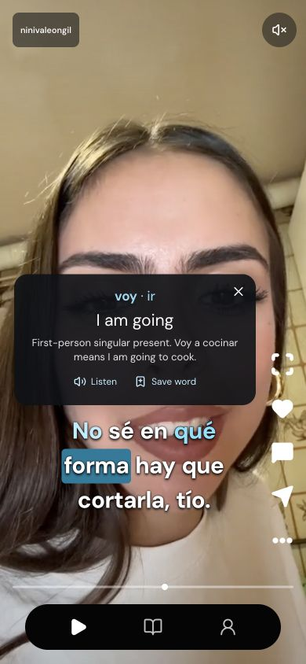

# LinguaLoop

LinguaLoop turns the short videos you already want to watch into language practice. Tap an unfamiliar word to understand it in context, save it, and revisit it alongside the conversation where you first heard it. The goal is simple: make immersing yourself in another language part of everyday life.

**Learn languages from videos you actually want to watch.** This repository contains a working mobile-first web prototype. Its demo uses three Spanish clips; Spanish is the example language, not the scope of the product.

## Try the learning loop

1. **Watch a clip.** Scroll through short videos with synchronized captions. Turn on English translations when you need help.
2. **Tap a word.** See its meaning in that sentence, hear its pronunciation, and save it without leaving the video.
3. **Practice in context.** Swipe right to open your flashcards. Recall the meaning, then replay the sentence with **Watch in context**.

Swipe left for the video tutor, open the full transcript to replay individual sentences, or scan text visible in a video frame. **Learn** collects saved words and offers a short review. **You** shows your practice and lets you adjust your preferences.



## Run it on your computer

You’ll need **Node.js 22 or newer** and npm.

```bash
git clone https://github.com/FlowerYes/lingualoop.git
cd lingualoop
npm ci
npm run dev
```

Open [localhost:3000](http://localhost:3000), choose Spanish, select your level and interests, and start watching. Videos begin muted; tap the sound control to hear them.

**No account, database, or API key is needed to try the demo.** Your saved words and progress stay in this browser. To start fresh, open **You → Reset demo**.

If port 3000 is busy, use `npm run dev -- --port 3007` and open that port instead.

## What works today

| Feature | What you can do |
| --- | --- |
| Video feed | Scroll between clips, pause, seek, rewind, and change playback speed |
| Captions and transcript | Follow timed captions, tap words, and replay a particular sentence |
| Vocabulary | Save words with their meaning and original context |
| Flashcards and review | Recall saved words and answer short practice questions |
| Video tutor | Ask about the clip using built-in practice responses or an optional AI provider |
| Text scan | Recognize Spanish text in the current frame locally in the browser |
| Learning preferences | Choose interests and a starting level; recommendations respond to learning signals |
| Progress | Track viewing time, explored clips, and collected words |

## A prototype, with clear boundaries

The current catalog is **three curated Spanish TikTok clips** with prepared, reviewed captions and definitions. This is not a live TikTok feed or an automatic video-import service, and it does not yet include a catalog for every language.

Without an API key, the tutor uses built-in practice responses based on the clip. Progress is stored locally, so it does not sync between devices. The app is a responsive website rather than a native iOS or Android release.

The bundled clips belong to their original creators. Source links, excerpt timings, and transcript details are in [the demo media notes](docs/TIKTOK.md). Inclusion here does not imply creator endorsement or grant rights to reuse their content elsewhere.

## Optional: enable live AI answers

Copy the example configuration:

```bash
cp .env.example .env.local
```

Add your own `OPENAI_API_KEY` to `.env.local`. You can also set `OPENAI_MODEL`; the example uses `gpt-4.1-mini`. Keep this file private. These variables belong on the server and must not use a `NEXT_PUBLIC_` prefix.

The app falls back to its built-in responses if the provider is unavailable. [AI behavior and limitations](docs/AI.md) explains the details.

## Working on the app

Built with **Next.js, React, TypeScript, Tailwind CSS, and Lucide**. Text scanning uses Tesseract.js in a local browser worker.

| Folder | What’s inside |
| --- | --- |
| `app/` | Pages, layouts, and server API routes |
| `components/` | Video player, captions, tutor, flashcards, and other interface pieces |
| `lib/` | Playback, vocabulary, learning logic, persistence, and AI integration |
| `data/` | Demo catalog, transcripts, and word definitions |
| `public/` | Video, image, and local text-recognition assets |
| `tests/` | Tests for the app’s behavior |
| `docs/` | Implementation notes, media sources, and verification records |

```bash
npm test                  # Run the tests
npm run lint              # Check code style
npm run build             # Create a production build
npm start                 # Serve that build on localhost:3000
```

Stop the development server before starting production on the same port. To check the bundled media, install `ffmpeg` and `ffprobe`, then run `npm run verify:media`. Media verification is not required to run the app.

Local environment files, dependencies, build output, pitch recordings, and presentation workspaces are excluded from this repository.

## The founders

**Ryan Ouardaoui**, a Columbia student, and **Riad Benyamna**, from the University of Southern Mississippi, are both Moroccan and each speaks four languages. LinguaLoop starts from their shared wish to make language immersion fit naturally into everyday life.
